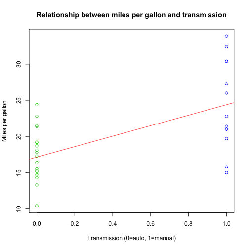
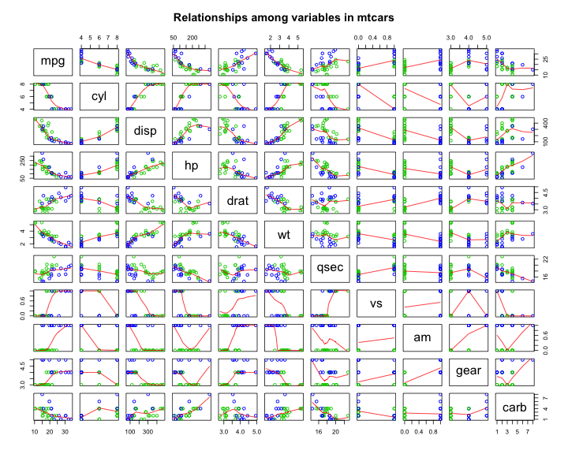
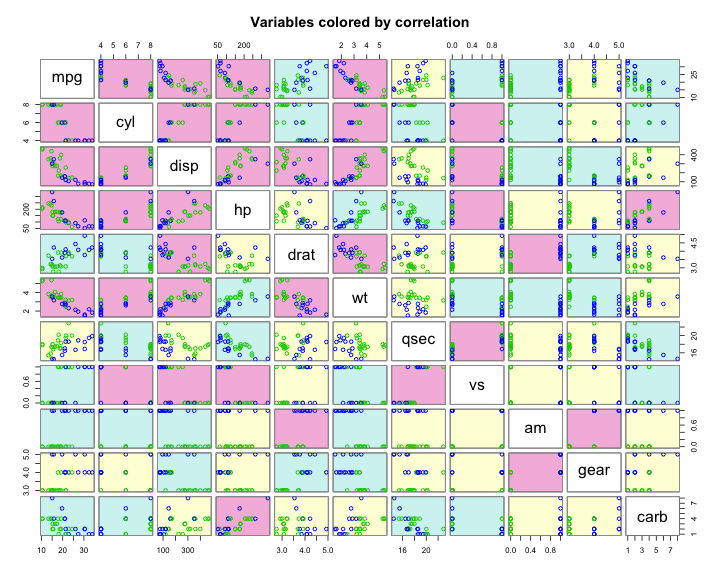
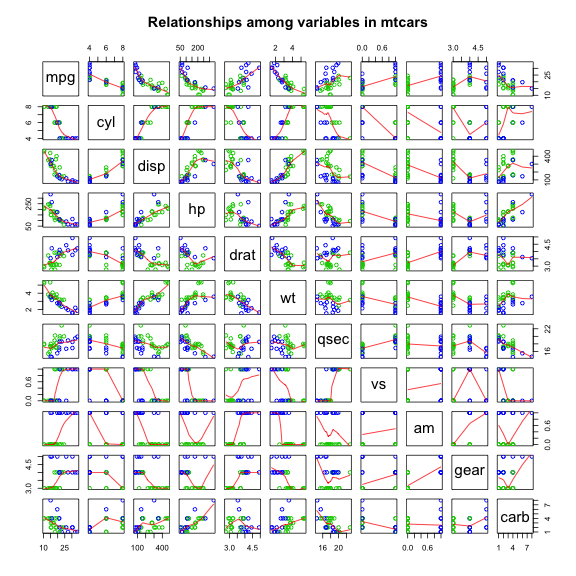
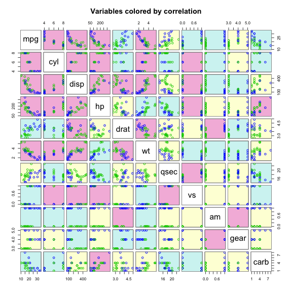

Relationship between transmission type and fuel economy
========================================================

## Executive summary

This report attempts to answer the following questions:
- “Is an automatic or manual transmission better for MPG”
- "Quantify the MPG difference between automatic and manual transmissions"

In order to find answers to these questions, I first conduct an initial exporation of the data before fitting a model and running diagnostics.  Finally, I use the model to answer the questions and 

Ultimately, the model I selected shows that the switch from an automatic to a manual transmission should result in a 1.8mpg gain in fuel economy; however, the model has a high level of uncertainty, so it should not be considered determinative.  Using another variable in the data set to predict MPG is likely to provide a more accurate result.

## Exploratory analysis

First, I need to load the data:


```r
data(mtcars)
```

Now I're ready to take a look at the data to see if there are any obvious relationships.  I'll start with the relationship between miles per gallon and transmission type.


```r
carMod <- lm(mpg ~ factor(am), data=mtcars)
plot(mtcars$am, mtcars$mpg, col= 3 + (mtcars$am > 0), main = "Relationship between miles per gallon and transmission", ylab = "Miles per gallon", xlab="Transmission (0=auto, 1=manual)")
abline(carMod, col="red")
```

 

There definitely seems to be a relationship between MPG and transmission type, and it appears at first glance that choosing a manual transmission should generally result in a more fuel-efficient car.

But what about potential confounders?  This pairs plot examines the relationships among the variables in the data set (the first row of plots contains the MPG relationships).


```r
pairs(mtcars, col=3 + (mtcars$am >0), panel=panel.smooth, main="Relationships among variables in mtcars")
```

 

The pairs plot shows that there are several variables that affect MPG, but it's still difficult to tell which variables affect MPG the most.  

This updated pairs plot colors the panels according to the correlation values so it's a little easier to discern the most important relationships between MPG and the other variables, and the correlations between the other variables themselves.


```r
require(gclus)
```

```
## Loading required package: gclus
## Loading required package: cluster
```

```r
mtcars.cor <- abs(cor(mtcars))
mtcars.col <- dmat.color(mtcars.cor)
cpairs(mtcars, panel.colors=mtcars.col, gap=.5, main="Variables colored by correlation", col=3 + (mtcars$am >0))
```

 

The colored pairs plot shows that there are certain variables that have a stronger correlation to changes in MPG than the transmission type.  Indeed, transmission type is one of the Iaker correlations among the variables.

This table of correlations shows the variables with the strongest correlation to MPG from left to right.  Transmission type has only the 7th strongest correlation with MPG.


```r
carCor <- cor(mtcars)[1,-1]
carCor <- carCor[order(-abs(carCor))]
carCor
```

```
##      wt     cyl    disp      hp    drat      vs      am    carb    gear 
## -0.8677 -0.8522 -0.8476 -0.7762  0.6812  0.6640  0.5998 -0.5509  0.4803 
##    qsec 
##  0.4187
```

Obviously, I will need to consider several different variables when constructing a model that will help us answer the question of whether an automatic or manual transmission is better for MPG.

## Determing the model

The first step in fitting the model is to compare different models that contain different variables.

To do this, I added variables to the initial mpg ~ am model and examined the anova of the resulting model.


```r
carMod <- lm(mpg ~ factor(am), data=mtcars)
carMod2 <- update(carMod, mpg ~ factor(am) + wt)
carMod3 <- update(carMod, mpg ~ factor(am) + wt + factor(cyl))
carMod4 <- update(carMod, mpg ~ factor(am) + wt + factor(cyl) + hp)
carMod5 <- update(carMod, mpg ~ factor(am) + wt + factor(cyl) + hp + disp)
```


```r
anova(carMod, carMod2, carMod3, carMod4,carMod5)
```

```
## Analysis of Variance Table
## 
## Model 1: mpg ~ factor(am)
## Model 2: mpg ~ factor(am) + wt
## Model 3: mpg ~ factor(am) + wt + factor(cyl)
## Model 4: mpg ~ factor(am) + wt + factor(cyl) + hp
## Model 5: mpg ~ factor(am) + wt + factor(cyl) + hp + disp
##   Res.Df RSS Df Sum of Sq     F  Pr(>F)    
## 1     30 721                               
## 2     29 278  1       443 73.56 6.5e-09 ***
## 3     27 183  2        95  7.92  0.0022 ** 
## 4     26 151  1        32  5.31  0.0298 *  
## 5     25 150  1         1  0.10  0.7515    
## ---
## Signif. codes:  0 '***' 0.001 '**' 0.01 '*' 0.05 '.' 0.1 ' ' 1
```

Based on the anova, I can determine that the model which includes the transmission type, Iight, number of cylinders, and horsepoIr (carMod4) is the most appropriate model.  I'm making this judgement based on the fact that it is the model that includes the most number of relevant variables without losing statistical significance according to the anova.

## Diagnosics

Now that I've selected a model, I must run diagnostics in order to determine whether there are any obvious issues with our model in terms of residuals or outliers.

### Residual plot

A model's residual values are the differences between the actual values and the expected values according to the model.  


```r
## Residual plot for the selected model
plot(predict(carMod4), resid(carMod4), main="Residuals vs. Fitted", ylab="Residuals", xlab="Fitted Values")
abline(lm(resid(carMod4) ~ predict(carMod4)), col="red")
```

 

The residuals for carMod4 are in a more or less random pattern, so it appears that a linear model is appropriate for this dataset.

### Dfbetas 

The dfbetas measure the effect on coefficient if you leave a particular data point out of the model.


```r
round(dfbetas(carMod4), 3)
```

```
##                     (Intercept) factor(am)1     wt factor(cyl)6
## Mazda RX4                 0.038      -0.195 -0.028       -0.281
## Mazda RX4 Wag             0.056      -0.132 -0.055       -0.148
## Datsun 710                0.051      -0.260 -0.170        0.292
## Hornet 4 Drive            0.146      -0.223 -0.105        0.253
## Hornet Sportabout         0.149      -0.069 -0.125        0.067
## Valiant                  -0.013       0.035 -0.002       -0.058
## Duster 360               -0.045       0.066  0.064        0.013
## Merc 240D                 0.020      -0.054  0.039       -0.087
## Merc 230                  0.000      -0.001  0.000       -0.001
## Merc 280                  0.029      -0.096 -0.016        0.091
## Merc 280C                -0.009       0.030  0.005       -0.029
## Merc 450SE                0.010       0.006  0.010        0.015
## Merc 450SL                0.053      -0.022 -0.037        0.027
## Merc 450SLC              -0.062       0.024  0.040       -0.033
## Cadillac Fleetwood        0.278      -0.162 -0.332        0.087
## Lincoln Continental       0.163      -0.086 -0.187        0.058
## Chrysler Imperial        -0.871       0.351  0.939       -0.391
## Fiat 128                  0.025       0.429  0.212       -0.195
## Honda Civic               0.056       0.028 -0.028       -0.002
## Toyota Corolla            0.336       0.289 -0.105       -0.139
## Toyota Corona            -0.507       0.731  0.364        0.477
## Dodge Challenger         -0.251       0.021  0.147       -0.184
## AMC Javelin              -0.352       0.055  0.230       -0.239
## Camaro Z28               -0.040       0.084  0.065        0.029
## Pontiac Firebird          0.135      -0.024 -0.060        0.094
## Fiat X1-9                -0.057      -0.076  0.003        0.037
## Porsche 914-2            -0.018      -0.058 -0.015        0.076
## Lotus Europa              0.269      -0.114 -0.282       -0.147
## Ford Pantera L            0.029      -0.097  0.066       -0.026
## Ferrari Dino              0.013      -0.014  0.003       -0.029
## Maserati Bora            -0.176       0.041 -0.088       -0.144
## Volvo 142E                0.329      -0.361 -0.433        0.424
##                     factor(cyl)8     hp
## Mazda RX4                 -0.155  0.136
## Mazda RX4 Wag             -0.078  0.088
## Datsun 710                 0.167  0.048
## Hornet 4 Drive            -0.049  0.052
## Hornet Sportabout          0.151 -0.057
## Valiant                    0.011  0.003
## Duster 360                 0.016 -0.069
## Merc 240D                 -0.075 -0.003
## Merc 230                  -0.001  0.001
## Merc 280                  -0.061  0.049
## Merc 280C                  0.019 -0.016
## Merc 450SE                 0.058 -0.047
## Merc 450SL                 0.073 -0.036
## Merc 450SLC               -0.095  0.050
## Cadillac Fleetwood         0.027  0.101
## Lincoln Continental        0.036  0.036
## Chrysler Imperial         -0.333  0.011
## Fiat 128                   0.079 -0.378
## Honda Civic                0.039 -0.050
## Toyota Corolla             0.176 -0.336
## Toyota Corona              0.544 -0.473
## Dodge Challenger          -0.407  0.295
## AMC Javelin               -0.513  0.350
## Camaro Z28                 0.034 -0.100
## Pontiac Firebird           0.270 -0.181
## Fiat X1-9                 -0.033  0.079
## Porsche 914-2              0.037  0.009
## Lotus Europa              -0.124  0.210
## Ford Pantera L            -0.052 -0.096
## Ferrari Dino               0.010 -0.023
## Maserati Bora             -0.248  0.525
## Volvo 142E                 0.359 -0.024
```

### Dffits 

The dffits measure the change in the predicted response when a particular data point is removed from the model.


```r
round(dffits(carMod4), 3)
```

```
##           Mazda RX4       Mazda RX4 Wag          Datsun 710 
##              -0.366              -0.211              -0.642 
##      Hornet 4 Drive   Hornet Sportabout             Valiant 
##               0.499               0.240              -0.117 
##          Duster 360           Merc 240D            Merc 230 
##              -0.105               0.147               0.002 
##            Merc 280           Merc 280C          Merc 450SE 
##               0.228              -0.072               0.109 
##          Merc 450SL         Merc 450SLC  Cadillac Fleetwood 
##               0.122              -0.160              -0.398 
## Lincoln Continental   Chrysler Imperial            Fiat 128 
##              -0.218               1.176               0.837 
##         Honda Civic      Toyota Corolla       Toyota Corona 
##               0.114               0.938              -0.909 
##    Dodge Challenger         AMC Javelin          Camaro Z28 
##              -0.514              -0.652              -0.149 
##    Pontiac Firebird           Fiat X1-9       Porsche 914-2 
##               0.428              -0.209              -0.185 
##        Lotus Europa      Ford Pantera L        Ferrari Dino 
##               0.484              -0.296              -0.064 
##       Maserati Bora          Volvo 142E 
##               0.703              -0.768
```

### Hat values

Hat values look at each data point's potential for influence.


```r
round(hatvalues(carMod4), 3)
```

```
##           Mazda RX4       Mazda RX4 Wag          Datsun 710 
##               0.234               0.250               0.112 
##      Hornet 4 Drive   Hornet Sportabout             Valiant 
##               0.184               0.137               0.176 
##          Duster 360           Merc 240D            Merc 230 
##               0.197               0.200               0.231 
##            Merc 280           Merc 280C          Merc 450SE 
##               0.184               0.184               0.093 
##          Merc 450SL         Merc 450SLC  Cadillac Fleetwood 
##               0.101               0.098               0.250 
## Lincoln Continental   Chrysler Imperial            Fiat 128 
##               0.294               0.261               0.133 
##         Honda Civic      Toyota Corolla       Toyota Corona 
##               0.161               0.128               0.278 
##    Dodge Challenger         AMC Javelin          Camaro Z28 
##               0.174               0.183               0.153 
##    Pontiac Firebird           Fiat X1-9       Porsche 914-2 
##               0.102               0.125               0.105 
##        Lotus Europa      Ford Pantera L        Ferrari Dino 
##               0.176               0.230               0.232 
##       Maserati Bora          Volvo 142E 
##               0.471               0.164
```

### Summary of diagnostics

Looking at the dfbetas, dffits, and hat values, it appears that the Maserati Bora has some strong effects on the coefficients and the greatest potential for influence.  Excluding the Maserati Bora from the data set might result in a better model.

## Answering the questions


```r
summary(carMod4)$coef
```

```
##              Estimate Std. Error t value  Pr(>|t|)
## (Intercept)  33.70832    2.60489 12.9404 7.733e-13
## factor(am)1   1.80921    1.39630  1.2957 2.065e-01
## wt           -2.49683    0.88559 -2.8194 9.081e-03
## factor(cyl)6 -3.03134    1.40728 -2.1540 4.068e-02
## factor(cyl)8 -2.16368    2.28425 -0.9472 3.523e-01
## hp           -0.03211    0.01369 -2.3450 2.693e-02
```

According to the model, the change from an automatic to a manual transmission (keeping all other variables constant) should result in a 1.81mpg increase in fuel efficiency.

Thus, the answers to the questions posed are:
- In general, manual transmissions are better for fuel effiency.
- There is a 1.8mpg gain in fuel economy going from an automatic to a manual transmission.

## Quantifying the uncertainty

In order to quantify the uncertainty, I'll need a confidence interval for any prediction based on the move from an automatic to a manual transmission


```r
sumCoef <- summary(carMod4)$coefficients
sumCoef[2,1] + c(-1,1)*qt(.975, df=carMod4$df) * sumCoef[2,2]
```

```
## [1] -1.061  4.679
```

These numbers tell us that moving from an automatic to a manual tranmission could have anywhere from a 1.1mpg loss in fuel efficiency to a 4.7mpg gain in fuel efficiency.

It's pretty clear that there is a lot of uncertainty in the model.  As a result, I should not rely on transmission type to make a determination about fuel efficiency.  It's possible to predict a positive effect of switching from an automatic to a manual transmission if all other variables are held constant, but the other variables have such a strong effect that the predicitive value of such an assumption is not very high.

## Conclusion

While the model predicts that switching from an automatic to a manual transmission should have a 1.8mpg gain in fuel economy, the predictive poIr of the model in regards to MPG is not very strong.  One of the other variables in the data set is most likely a better predictor of fuel economy.

## Appendix - Figures

### Figure 1


```r
plot(mtcars$am, mtcars$mpg, col= 3 + (mtcars$am > 0), main = "Relationship between miles per gallon and transmission", ylab = "Miles per gallon", xlab="Transmission (0=auto, 1=manual)")
abline(carMod, col="red")
```

 

### Figure 2


```r
pairs(mtcars, col=3 + (mtcars$am >0), panel=panel.smooth, main="Relationships among variables in mtcars")
```

 

### Figure 3


```r
require(gclus)
mtcars.cor <- abs(cor(mtcars))
mtcars.col <- dmat.color(mtcars.cor)
cpairs(mtcars, panel.colors=mtcars.col, gap=.5, main="Variables colored by correlation", col=3 + (mtcars$am >0))
```

 

### Figure 4


```r
## Residual plot for the selected model
plot(predict(carMod4), resid(carMod4), main="Residuals vs. Fitted", ylab="Residuals", xlab="Fitted Values")
abline(lm(resid(carMod4) ~ predict(carMod4)))
```

 

